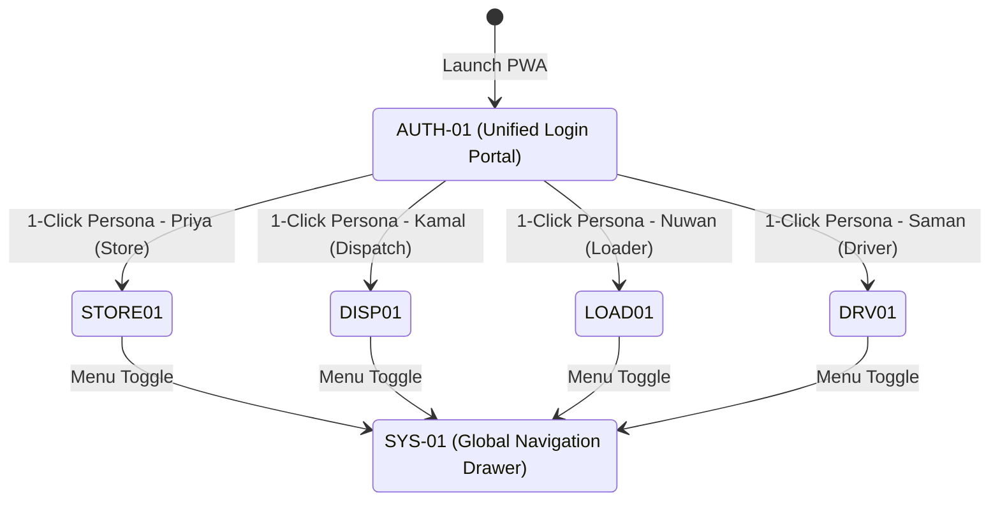
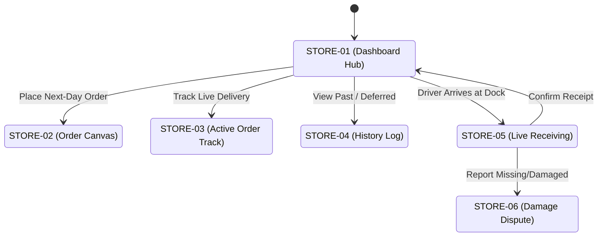
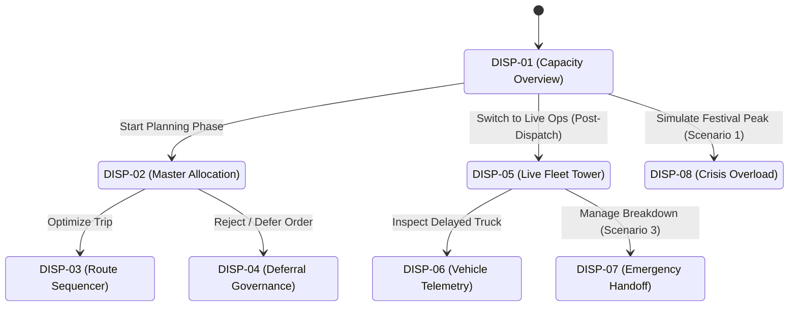
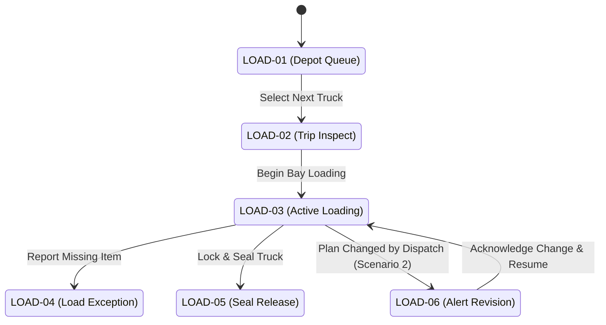
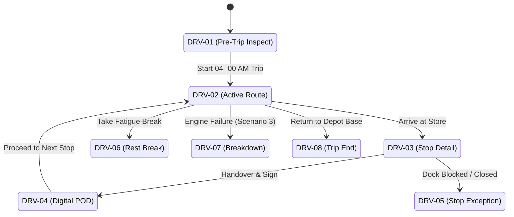

# Waypoint Dispatch: Screen Flow Diagrams & Rationales

This document maps the complete information architecture and screen navigation flows for the four distinct personas interacting with the Waypoint Dispatch platform. Each screen is justified against the core design principles: **Cognitive Offloading**, **Anxiety Reduction**, and **Fatigue-Resistant UX**, alongside explicit mapping to the 3 Degradation Scenarios.

---

## 1. Global Authentication & Judge Walkthrough

### Rationales
- **AUTH-01 (Unified Role-Switch & Judge Walkthrough Portal):** Reduces cognitive load for Hackathon Judges by eliminating complex auth workflows. A 1-click seeded entry point bypasses manual data entry and drops the judge directly into the operational reality of the specific persona, instantly establishing context and preventing onboarding frustration.
- **SYS-01 (Global Navigation Drawer):** Ensures cross-cutting concerns (profile, logout, accessibility toggles) are centralized. Implements cognitive offloading by maintaining consistent spatial navigation regardless of the persona's current context.

---

## 2. Store Manager Experience (Priya)
**Theme:** Serene Retail (Light) | **Environment:** Daytime POS Counter

### Rationales
- **STORE-01 (Store Operations Hub):** Anxiety Reduction is achieved by surfacing the most critical metric immediately: the arrival delta (e.g., "ETA: 18 mins away") instead of static times. This allows Priya to manage floor staff efficiently without constant worry over when the truck will arrive.
- **STORE-02 (Order Placement Canvas):** Uses Cognitive Offloading by restricting order combinations based on temperature zones (ambient vs. chilled) before submission. This inherently prevents illegal load requests and strictly enforces the 16:00 cutoff visually, preventing silent overnight rejections from dispatch.
- **STORE-03 (Active Order Detail & Live Track):** Reduces anxiety by providing live GPS breadcrumbs of the delivery vehicle. Priya no longer needs to call central dispatch for updates; visual proof that the 08:00 AM freshness mandate will be met is readily available on her screen.
- **STORE-04 (Order & Deferral History Log):** Provides transparent governance. Instead of silent deferrals that cause inter-departmental friction, Priya sees exact reasons (e.g., "Overloaded Capacity Peak") ensuring she understands her order's status and its bumped priority for the next day.
- **STORE-05 (Live Receiving & Seal Verification):** Fatigue-Resistant UX uses 64px tap targets for fast, error-free physical dock operations. The tamper-evident seal verification step offloads chain-of-custody tracking from memory to an immutable system record.
- **STORE-06 (Damage / Shortage Dispute):** Offloads the cognitive burden of remembering and arguing over discrepancies by capturing photographic evidence at the exact moment of delivery, enabling immediate dispute resolution and automated credit note generation.

---

## 3. Central Fleet Dispatcher Experience (Kamal)
**Theme:** Midnight Oceanic (Dark) | **Environment:** Night Control Tower, 27" Dual-Monitors

### Rationales
- **DISP-01 (Fleet Capacity Hub):** Employs Cognitive Offloading by surfacing macro-level volume and weight deficits across the entire network before granular planning begins. This prevents Kamal from discovering capacity constraints three hours into a planning session.
- **DISP-02 (Master Allocation Canvas):** Replaces error-prone mental math with visual constraint blocks. This dramatically reduces anxiety by mathematically clamping assignments—it is visually impossible to drop an ambient truck onto a frozen order or exceed axle weight without a hard system block.
- **DISP-03 (Route Sequencer):** Automates reverse-LIFO sorting for dock loading. Kamal doesn't have to manually calculate loading sequences; the system offloads this logic to ensure field drivers don't have to restack cargo on the roadside in the rain.
- **DISP-04 (Consecutive Deferral Governance):** Prevents silent constraint violations by enforcing service equity. Kamal must explicitly declare a taxonomy reason for rolling an order, ensuring remote outlets aren't chronically starved of inventory on consecutive days.
- **DISP-05 (Live Fleet Control Tower):** Implements Exception-First sorting. Instead of scanning 60 trucks, Kamal's attention is immediately drawn to the 2 delayed vehicles, drastically reducing cognitive load during the high-stress 06:00 - 08:00 AM delivery window.
- **DISP-06 (Vehicle Telemetry Drawer):** Provides instant context without navigating away from the live map. Kamal can instantly check fuel quotas and driver contact info when intervening on delayed runs.
- **DISP-07 (Emergency Handoff / Degradation Scenario 3):** When a reefer breaks down, Kamal is presented with immediate rescue vehicle options and temperature spoilage countdowns. This replaces panic with a structured, step-by-step cold-chain recovery workflow.
- **DISP-08 (Crisis Overload / Degradation Scenario 1):** During festival demand surges, this specific mode applies drastic heuristics to prioritize essential goods, structurally managing chaos and preventing dispatcher paralysis when demand outstrips fleet limits by 40%.

---

## 4. Dock Loader Experience (Nuwan)
**Theme:** Midnight Oceanic (High Contrast) | **Environment:** Noisy, Cold Warehouse Bay, Tablets & Gloves

### Rationales
- **LOAD-01 (Depot Queue):** Adheres to Fatigue-Resistant UX with massive touch targets. Nuwan operates in a noisy, cold environment wearing gloves; this queue ensures he selects the correct next trip without needing fine-motor precision.
- **LOAD-02 (Trip Inspection):** Offloads safety compliance from human memory to a mandatory digital checklist, ensuring the vehicle condition (e.g., pre-chilled reefer box) is documented before any cargo is moved.
- **LOAD-03 (Active Loading Checklist):** Employs strict reverse-LIFO step-by-step guidance. Nuwan doesn't have to think about which pallet goes in first; the system enforces the correct physical sequence to guarantee perfect unloads at the store.
- **LOAD-04 (Loading Exception):** Enables Nuwan to instantly flag warehouse shortages or damaged pallets before the truck leaves the dock. This protects both him and the driver from being falsely blamed for discrepancies upon store arrival.
- **LOAD-05 (Vehicle Release & Seal):** Locks the payload integrity. By inputting the tamper-evident seal number, the system establishes a definitive digital chain of custody that the Store Manager will be forced to verify upon arrival.
- **LOAD-06 (Mid-Load Alert Revision / Degradation Scenario 2):** Uses an Industrial Amber full-screen lockout to violently interrupt Nuwan if Kamal alters the plan while loading is in progress. This guarantees the change is acknowledged over the noise of the warehouse, preventing misloaded trucks.

---

## 5. Field Delivery Driver Experience (Saman)
**Theme:** Midnight Oceanic (High Contrast) | **Environment:** Dark Truck Cab, Rain, No Signal, Smartphone

### Rationales
- **DRV-01 (Pre-Trip Inspection):** A mandatory offline-first safety gate. Saman verifies reefer temperatures and vehicle integrity before departure, offloading compliance logging and ensuring vehicle safety standards are met despite early morning fatigue.
- **DRV-02 (Active Route & Maps):** Designed for extreme fatigue resistance (high contrast, thumb-zone controls) and 100% offline capability (Service Workers/IndexedDB). Saman doesn't need to worry about losing his paper route sheet in the rain or dropping connectivity in the Kadugannawa mountain pass.
- **DRV-03 (Stop Detail & Dock Notes):** Offloads memory by providing specific local dock navigation notes (e.g., "avoid low cables at rear entrance"). This massively reduces anxiety when approaching unfamiliar delivery locations in pitch darkness.
- **DRV-04 (Proof of Delivery / POD):** Replaces fragile paper run sheets with a digital signature and seal verification process. This eliminates Saman's anxiety about being blamed for discrepancies, as the digital handoff is immutable.
- **DRV-05 (Delivery Exception):** Provides a structured way to report field issues (e.g., store closed, dock blocked) without requiring a cellular signal to call dispatch, syncing the data automatically via Background Sync when connectivity returns.
- **DRV-06 (Non-Punitive Rest Break):** Actively reduces anxiety by displaying explicit "no penalty" messaging. Saman is encouraged to take mandatory safety rests without fear of being penalized for route delays.
- **DRV-07 (Emergency Breakdown / Degradation Scenario 3):** An Industrial Amber one-tap panic button that captures GPS coordinates and spoilage timers instantly, ensuring Saman can trigger a rescue operation even under extreme stress.
- **DRV-08 (Trip End & Debrief):** Provides a clear, satisfying conclusion to the 14-hour shift, summarizing completed drops and ensuring any remaining offline data is queued for sync upon returning to the depot WiFi.

---

## Cross-Persona Systemic Value
The true value of Waypoint Dispatch emerges in how these flows interconnect:
- When **Nuwan** records a seal in `LOAD-05`, **Priya** is forced to verify it in `STORE-05`.
- When **Kamal** changes a sequence in `DISP-03`, **Nuwan** receives a lockout alert in `LOAD-06`.
- When **Saman** hits breakdown in `DRV-07`, **Kamal** receives an emergency modal in `DISP-07` and **Priya** sees an updated ETA in `STORE-01`. 
- **Everything is linked. Nothing operates in a silo.**
